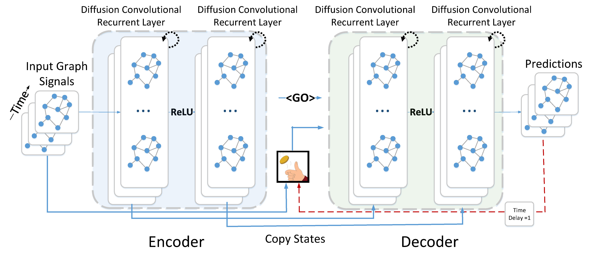

# Diffusion Convolutional Recurrent Neural Network: Data-Driven Traffic Forecasting



This is a TensorFlow implementation of Diffusion Convolutional Recurrent Neural Network in the following paper: \
Yaguang Li, Rose Yu, Cyrus Shahabi, Yan Liu, [Diffusion Convolutional Recurrent Neural Network: Data-Driven Traffic Forecasting](https://arxiv.org/abs/1707.01926), ICLR 2018.


## Requirements
- scipy>=0.19.0
- numpy>=1.12.1
- pandas>=0.19.2
- tensorflow>=1.3.0
- pyaml


Dependency can be installed using the following command:
```bash
pip install -r requirements.txt
```

## Data Preparation
The traffic data file for Los Angeles, i.e., `df_highway_2012_4mon_sample.h5`, is available [here](https://drive.google.com/open?id=1tjf5aXCgUoimvADyxKqb-YUlxP8O46pb), and should be
put into the `data/METR-LA` folder.
Besides, the locations of sensors are available at [data/sensor_graph/graph_sensor_locations.csv](https://github.com/liyaguang/DCRNN/blob/master/data/sensor_graph/graph_sensor_locations.csv).
```bash
python -m scripts.generate_training_data --output_dir=data/METR-LA
```
The generated train/val/test dataset will be saved at `data/METR-LA/{train,val,test}.npz`.


## Run the Pre-trained Model

```bash
python run_demo.py
```
The generated prediction of DCRNN is in `data/results/dcrnn_predictions_[1-12].h5`.


## Model Training
```bash
python dcrnn_train.py --config_filename=data/model/dcrnn_config.yaml
```
Each epoch takes about 5min with a single GTX 1080 Ti.

## Graph Construction
 As the currently implementation is based on pre-calculated road network distances between sensors, it currently only
 supports sensor ids in Los Angeles (see `data/sensor_graph/sensor_info_201206.csv`).

```bash
python -m scripts.gen_adj_mx.py  --sensor_ids_filename=data/sensor_graph/graph_sensor_ids.txt --normalized_k=0.1\
    --output_pkl_filename=data/sensor_graph/adj_mx.pkl
```

More details are being added ...

## Citation

If you find this repository useful in your research, please cite the following paper:
```
@inproceedings{li2018dcrnn_traffic,
  title={Diffusion Convolutional Recurrent Neural Network: Data-Driven Traffic Forecasting},
  author={Li, Yaguang and Yu, Rose and Shahabi, Cyrus and Liu, Yan},
  booktitle={International Conference on Learning Representations (ICLR '18)},
  year={2018}
}
```
